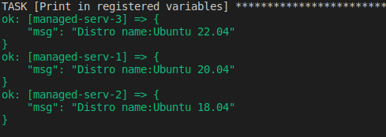

### Ansible task

1. Deployed and configured 4 VMs on AWS (1 - controller and 3 - managed-servers).

2. Created a inventory file(hosts.yml) with four groups, group named iaas included childrens from two first groups.
3. Create reusable roles:
   -  creating a empty file /etc/iaac with rigths 0500;
   -  get the name and version of the linuch distribution in the registered variables.
4. Created task in playbook.yml, print registered variables

5. Created task in playbook.yml, print hostname with registered variables.

6. Encrypted user pass with vault help.
___VAULT PASS:___ 123456